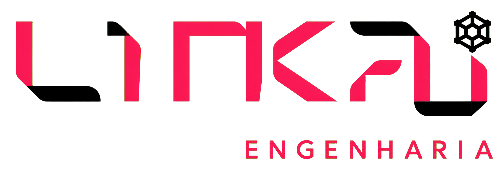
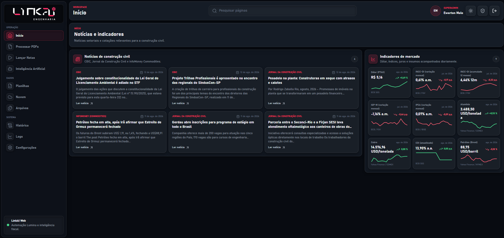

<p align="center">
  
</p>

<h1 align="center">LINKAI</h1>

<p align="center">
  Automação fiscal, processamento inteligente de documentos e operação conectada para a construção civil.
</p>

<p align="center">
  <a href="https://linkai.2lock.app.br">Aplicação publicada</a>
  ·
  <a href="https://github.com/GIT2LOCK/linkainotas">Repositório</a>
</p>

<p align="center">
  
  
  
  
</p>

## Visão geral

O LINKAI é uma plataforma empresarial da LINKAI Engenharia para organizar rotinas fiscais e reduzir trabalho manual na operação de documentos. A aplicação combina uma interface web moderna, um serviço Python de processamento e integrações de nuvem em um único produto.

O sistema foi desenhado para manter cada responsabilidade no lugar certo:

- **Processar PDFs:** leitura, identificação do layout fiscal e geração de XML normalizado.
- **Excel opcional:** exportação estruturada somente quando o usuário solicitar.
- **Nuvem:** seleção e processamento de documentos armazenados em bucket privado.
- **Lançar Notas:** automação do ERP Lumina sob demanda.
- **Notícias e indicadores:** acompanhamento diário de informações relevantes para a construção civil.
- **Operação:** histórico, logs, arquivos, planilhas, configurações e inteligência artificial em uma navegação única.

> O processamento de PDFs e a geração de XML não dependem do Lumina. A automação do Lumina é usada apenas nos fluxos que realmente precisam interagir com o ERP.

## Produto em uso

### Notícias e indicadores

A página inicial reúne notícias de fontes ligadas à construção civil e indicadores de mercado em uma visão operacional compacta.

<p align="center">
  
</p>

### Processamento fiscal

A tela de processamento concentra a escolha da origem, a leitura dos documentos, as opções de processamento e o acompanhamento dos resultados.

<p align="center">
  
</p>

## Capacidades principais

### Documentos fiscais

- Seleção de arquivos manuais, pastas locais ou documentos na nuvem.
- Leitura de PDFs com PyMuPDF e suporte arquitetural para OCR.
- Detecção determinística do layout antes da escolha do parser.
- Parsers especializados para NFS-e de São Paulo e NF-e DANFE modelo 55.
- Preservação de itens, tributos, parcelas, totais, validações e metadados de origem.
- Cache, hash SHA-256, prevenção de duplicidade e processamento de subpastas.

### XML e Excel

- O PDF é convertido sempre para XML normalizado no formato `linkai.documento-fiscal.v1`.
- Esse XML é um formato interno estruturado do LINKAI; ele não substitui o XML oficial autorizado pela SEFAZ.
- A geração de Excel é opcional e pode ser ativada pelo usuário.
- A exportação organiza documentos, itens, parcelas, tributos e validações em abas próprias.
- Quando solicitado no ambiente web, o arquivo é entregue para download no navegador do usuário.

### Automação Lumina

- Execução somente mediante ação explícita do usuário.
- Serviço Python desacoplado da interface React.
- Comunicação por API FastAPI quando o processamento estiver hospedado em outra máquina.
- Compatibilidade com execução local e com serviço publicado na rede.

### Dados e operação

- Integração com armazenamento privado na nuvem.
- Notícias e indicadores atualizados de forma automática.
- Histórico de processamento, arquivos, planilhas e logs.
- Temas claro e escuro seguindo a identidade visual da LINKAI.
- Layout responsivo para desktop, tablet e telas menores.

## Identidade visual

O produto usa uma linguagem escura, técnica e discreta, com profundidade neumórfica controlada e glassmorphism apenas em superfícies estratégicas.

| Token | Valor | Uso |
| --- | --- | --- |
| Fundo principal | `#080B11` | Área de trabalho e navegação |
| Sidebar | `#0D1119` | Navegação lateral |
| Superfície | `#111720` | Cards e painéis |
| Superfície elevada | `#161D27` | Controles e áreas de destaque |
| Texto principal | `#F4F6FA` | Títulos e dados importantes |
| Texto secundário | `#A0A8B5` | Descrições e informações auxiliares |
| Destaque LINKAI | `#E72C50` | Ações principais, seleção e estados ativos |
| Destaque claro | `#FF3B62` | Hover, foco e realces |
| Sucesso | `#42D886` | Processamento concluído e indicadores positivos |

A logo oficial está versionada em:

- `src/features/lumina/assets/linkai-logo.png` para superfícies escuras.
- `src/features/lumina/assets/linkai-logo-light.png` para superfícies claras.
- `src/features/lumina/assets/linkai-icon.png` para usos compactos.

## Arquitetura

```text
linkainotas/
|-- backend/                  API FastAPI e serviços de integração
|   |-- api/                  Endpoints web e bridge de comandos
|   |-- models/               Contratos de entrada e saída
|   `-- services/             Orquestração do processamento
|
|-- lumina_bot/               Núcleo Python fiscal e automação Lumina
|   |-- core/                 Leitor de PDF, detector, processador e writers
|   |-- models/               Modelos fiscais normalizados
|   |-- parsers/              Parsers especializados por layout
|   `-- requirements.txt      Dependências Python
|
|-- src/                      Aplicação React + TanStack Router
|   |-- features/lumina/      Shell, páginas, componentes e serviços do produto
|   |-- routes/               Rotas baseadas em arquivos
|   `-- styles/               Tokens e estilos globais
|
|-- docs/                     Documentação técnica e capturas do produto
|-- supabase/                 Migrações e funções de integração
|-- tests/                    Testes do processamento fiscal
|-- scripts/                  Utilitários de desenvolvimento
|-- package.json              Scripts e dependências do frontend
`-- README.md
```

### Camadas

1. **Interface:** React, TypeScript, TanStack Router, Radix UI, Lucide e Vite.
2. **Serviços:** FastAPI, contratos HTTP, autenticação de bridge e orquestração.
3. **Processamento:** PyMuPDF, pdfplumber, parsers fiscais, modelos normalizados e exportadores.
4. **Integrações:** armazenamento em nuvem, serviço do Lumina e fontes de notícias e indicadores.

## Rotas principais

O projeto utiliza roteamento baseado em arquivos com TanStack Router:

| Rota | Função |
| --- | --- |
| `/` | Login e entrada da aplicação |
| `/dashboard` | Notícias, indicadores e visão inicial |
| `/processar-pdfs` | Leitura de documentos e processamento fiscal |
| Demais telas internas | Lançamento de notas, IA, planilhas, nuvem, arquivos, histórico, logs e configurações |

As páginas internas compartilham o mesmo shell, sidebar, topbar, tema, componentes e estados de interação. A tela de login permanece isolada do shell autenticado.

## API de processamento

O serviço FastAPI fica em `backend/api/server.py` e expõe os principais endpoints:

| Método | Endpoint | Finalidade |
| --- | --- | --- |
| `GET` | `/health` | Verificar disponibilidade do serviço |
| `POST` | `/invoke` | Executar comandos da bridge |
| `POST` | `/uploads/documents` | Processar documentos e gerar XML/Excel opcional |
| `POST` | `/uploads/pdfs` | Processar PDFs enviados pela interface |

Em ambiente publicado, o frontend deve receber a URL pública do serviço pela variável `LINKAI_PROCESSING_URL`. Em produção, prefira HTTPS para evitar bloqueio de conteúdo misto pelo navegador.

## Configuração

### Frontend

Crie um arquivo `.env.local` na raiz quando necessário:

```env
VITE_SUPABASE_URL=https://seu-projeto.supabase.co
VITE_SUPABASE_ANON_KEY=sua-chave-anonima
VITE_SITE_URL=https://seu-dominio.example
LINKAI_PROCESSING_URL=https://seu-endereco-do-servico.example
```

Chaves administrativas e `SERVICE_ROLE_KEY` nunca devem ser expostas no frontend. Elas pertencem somente ao ambiente seguro do backend.

### Backend

O serviço Python usa as configurações do ambiente do processo ou de um arquivo `.env` protegido. Nunca versionar credenciais reais, senhas, tokens, documentos, planilhas geradas ou logs.

Variáveis normalmente utilizadas:

```env
SUPABASE_URL=https://seu-projeto.supabase.co
SUPABASE_SERVICE_ROLE_KEY=
SUPABASE_BUCKET=
SUPABASE_FOLDER=
LINKAI_ALLOWED_ORIGINS=https://seu-dominio.example
LINKAI_PROCESSING_TOKEN=
LINKAI_BRIDGE_TOKEN=
```

## Desenvolvimento local

### Requisitos

- Node.js 20 ou superior.
- npm ou Bun.
- Python 3.12 ou superior para o serviço de processamento.
- Git.

### Instalar e executar o frontend

```bash
git clone https://github.com/GIT2LOCK/linkainotas.git
cd linkainotas
npm install
npm run dev
```

O frontend ficará disponível em `http://localhost:5173`.

### Executar o serviço Python

No Windows:

```powershell
py -3.12 -m venv lumina_bot\.venv
.\lumina_bot\.venv\Scripts\Activate.ps1
python -m pip install -r backend\requirements.txt
python -m uvicorn backend.api.server:app --host 127.0.0.1 --port 8765
```

No Ubuntu:

```bash
python3 -m venv lumina_bot/.venv
source lumina_bot/.venv/bin/activate
python -m pip install -r backend/requirements.txt
python -m uvicorn backend.api.server:app --host 0.0.0.0 --port 8765
```

Verifique a disponibilidade:

```bash
curl http://127.0.0.1:8765/health
```

Para acesso pela rede, libere a porta no firewall e publique o endereço por HTTPS quando o frontend estiver em HTTPS.

## Comandos de qualidade

```bash
# Build de produção do frontend
npm run build

# Lint
npm run lint

# Testes do processamento fiscal
python -m unittest discover -s tests -v

# Verificação de sintaxe Python
python -m py_compile backend/api/server.py lumina_bot/core/*.py lumina_bot/parsers/*.py
```

## Testes fiscais

Os testes em `tests/test_fiscal_layouts.py` validam os fluxos principais de leitura e extração:

- NFS-e de São Paulo.
- NF-e DANFE modelo 55.
- Detecção de layout antes do parser.
- Itens, totais, tributos, parcelas e validações.
- Geração do XML normalizado.

Documentos reais e dados sensíveis não devem ser versionados. Para testes locais, utilize fixtures controladas ou arquivos armazenados fora do repositório.

## Segurança operacional

- Não versionar `.env`, tokens, senhas, chaves administrativas ou `SERVICE_ROLE_KEY`.
- Usar a chave anônima somente no frontend quando necessário.
- Manter a chave de serviço somente no backend.
- Proteger endpoints de processamento com token quando expostos na rede.
- Restringir CORS aos domínios autorizados em produção.
- Usar HTTPS no domínio público da API.
- Evitar salvar arquivos do usuário em diretórios públicos do servidor.

## Contribuição

1. Crie uma branch descritiva a partir de `main`.
2. Faça alterações pequenas e relacionadas ao objetivo da tarefa.
3. Execute build, lint e testes aplicáveis.
4. Confira `git diff` e `git status --ignored` antes do commit.
5. Nunca inclua credenciais, PDFs, planilhas ou logs no commit.
6. Abra um pull request com contexto, validação e impacto da alteração.

## Licença e propriedade

Projeto privado da 2LOCK / LINKAI Engenharia. O código, a identidade visual e os fluxos de automação pertencem ao projeto e não devem ser redistribuídos sem autorização.
